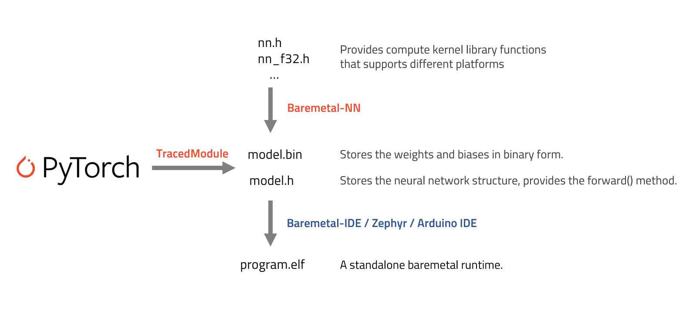

# Baremetal-NN



Baremetal-NN is a tool for converting PyTorch models into raw C codes that can be executed standalone in a baremetal runtime on research chips. 

## Convert the model

```bash
python ./scripts/convert.py
```

### In C mode:

the converter will dump out three files:

`nn.h`: stores the library definition.

`operators.h`: stores the operator definitions.

`weights.h`: stores the weights and biases of the network.

`model.h`: stores the code representation of the model forward pass.


### In numpy mode:

the converter will dump out three files:

`nn.py`

`operators.py`

`weights.py`

`model.py`

