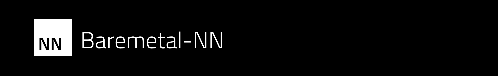

# Baremetal-NN


[](https://opensource.org/license/apache-2-0)

Baremetal-NN is a tool for converting PyTorch models into raw C codes that can be executed standalone in a baremetal runtime on research chips. 


> Note:
> After a discussion with [@iansseijelly](https://github.com/iansseijelly), we decided to switch to the simpler way of assuming array will be contiguous, and therefore directly use shape to index into elements, instead of the more generic strided access. The previous strided implementation can be access on the ["strided"](https://github.com/ucb-bar/Baremetal-NN/tree/strided) branch.

## Getting Started

Refer to the [API Doc](https://ucb-bar.github.io/Baremetal-NN/nn_8h.html) for an overview of the available datatypes and functions.

## Run Test

### Building for x86

first, we clean any previous builds

```bash
rm -rf ./build/
```

```bash
cmake -S ./ -B ./build/ -D CMAKE_BUILD_TYPE=Debug
cmake --build ./build/ --target tests
./build/tests/tests
```

### Building for RISC-V

first, we clean any previous builds

```bash
rm -rf ./build/
```

```bash
# make sure $RISCV is set
cmake -S ./ -B ./build/ -D CMAKE_BUILD_TYPE=Debug -D CMAKE_TOOLCHAIN_FILE=./riscv-gcc.cmake
cmake --build ./build/ --target tests
spike ./build/tests/tests.elf
```

### Building for RISC-V with Vector Support

first, we clean any previous builds

```bash
rm -rf ./build/
```

```bash
# make sure $RISCV is set
cmake -S ./ -B ./build/ -D CMAKE_BUILD_TYPE=Debug -D CMAKE_TOOLCHAIN_FILE=./riscv-gcc.cmake -D CONFIG_BACKEND_RISCV_V=ON
cmake --build ./build/ --target tests
spike --isa=rv64gcv_zicntr_zfh ./build/tests/tests.elf
```

Running with FP16 support

```bash
cmake -S ./ -B ./build/ -D CMAKE_BUILD_TYPE=Debug -D CMAKE_TOOLCHAIN_FILE=./riscv-gcc.cmake -D CONFIG_BACKEND_RISCV_V=ON -D CONFIG_BACKEND_RISCV_ZVFH=ON
cmake --build ./build/ --target tests
spike --isa=rv64gcv_zicntr_zfh_zvfh ./build/tests/tests.elf
```

Running with FP16 support with GCC<14.0

For GCC<14.0, it does not support the fp16 intrinsics, so we need to use the assembly implementation. (TO BE FIXED)

```bash
cmake -S ./ -B ./build/ -D CMAKE_BUILD_TYPE=Debug -D CMAKE_TOOLCHAIN_FILE=./riscv-gcc.cmake -D CONFIG_BACKEND_RISCV_V=ON -D RISCV_ZVFH=ON -D RISCV_V_ASM=ON
cmake --build ./build/ --target tests
spike --isa=rv64gcv_zicntr_zfh_zvfh ./build/tests/tests.elf
```

### Building for RISC-V with Gemmini (Not working for now)

first, we clean any previous builds

```bash
rm -rf ./build/
```

```bash
cmake -S ./ -B ./build/ -D CMAKE_BUILD_TYPE=Debug -D CMAKE_TOOLCHAIN_FILE=./riscv-gcc.cmake -D GEMMINI=ON
cmake --build ./build/ --target all
spike --extension=gemmini ./build/tests/tests.elf
```

### Building for K230 board

first, we clean any previous builds

```bash
rm -rf ./build/
```

```bash
cmake -S ./ -B ./build/ -G "Unix Makefiles" -D CMAKE_TOOLCHAIN_FILE=./k230-gcc.cmake -D CMAKE_BUILD_TYPE=Debug -D RISCV_V=ON -D RISCV_V_ASM=ON
cmake --build ./build/ --target all
```

### Cleaning build files

```
cmake --build ./build/ --target clean
```

### Cleaning CMake files

```
rm -rf ./build/
```


## Supported config flags

CONFIG_DTYPE_ENABLE_F16: enable F16 support.

CONFIG_DTYPE_ENABLE_I32: enable I32 support.

CONFIG_BACKEND_RISCV_V: use RISC-V Vector backend.

CONFIG_BACKEND_RISCV_ZVFH: use RISC-V Vector Floating-Point Hardware for the FP16 operations.

CONFIG_DEBUG_RISCV_V_USE_REDOSUM: use REDOSUM for the reduction operation in RVV. By default, it uses REDUSUM.


## Support matrix of backends and operators

| Operator                | Variants  | Scalar CPU | RISC-V Vector | Gemmini |
| ----------------------- | --------- | ---------- | ------------- | ------- |
| min                     | F16       | ✅         | ✅ (ZVFH)    |         |
|                         | F32       | ✅         | ✅           |         |
| max                     | F16       | ✅         | ✅ (ZVFH)    |         |
|                         | F32       | ✅         | ✅           |         |
| add                     | I32       | ✅         | 🔜           |         |
|                         | F16       | ✅         | ✅ (ZVFH)    |         |
|                         | F32       | ✅         | ✅           |         |
| addscalar               | F16       | ✅         | ✅ (ZVFH)    |         |
|                         | F32       | ✅         | ✅           |         |
| mul                     | F16       | ✅         | ❌ (ZVFH)    |         |
|                         | F32       | ✅         | ❌           |         |
| mulscalar               | F16       | ✅         | ❌ (ZVFH)    |         |
|                         | F32       | ✅         | ❌           |         |
| matmul (mm)             | F16       | ✅         | ✅ (ZVFH)    |         |
|                         | F32       | ✅         | ✅           |         |
| addmatmul (addmm)       | I32       | ✅         | 🔜           |         |
|                         | F16       | ✅         | ✅ (ZVFH)    |         |
|                         | F32       | ✅         | ✅           |         |
| linear                  | F16       | ✅         | ✅ (ZVFH)    |         |
|                         | F32       | ✅         | ✅           |         |
| elu                     | F16       | ✅         |              |         |
|                         | F32       | ✅         |              |         |
| relu                    | F16       | ✅         | ✅ (ZVFH)    |         |
|                         | F32       | ✅         | ✅           |         |
| tanh                    | F16       | ✅         |              |         |
|                         | F32       | ✅         |              |         |
| softmax                 | F16       |            |              |         |
|                         | F32       | ✅         |              |         |
| scaled_dot_product_attention | F16       |            |              |         |
|                         | F32       | ⚠️         |              |         |

✅: supported

⚠️: partially supported, failing on some tests

❌: not supported

🔜: planned


## Convert the model

First, we need to install the Baremetal-NN converter Python library.

```bash
# Install from PyPI
pip install baremetal-nn

# Install locally
pip install -e ./baremetal-nn/
```


To export PyTorch model, we will use the `TracedModule` in this converter library. Assuming the PyTorch model is named `model`, we will wrap it with `TracedModule`.

```python
from baremetal_nn import TracedModule

m = TracedModule(model)
```

Then, we need to perform at least one round of inference to let the tool trace the entire forward flow and record the dimension and shape of each layer.

```python
example_output = m.forward(example_input)
```

The output content is not used. It is a good idea to examine the output value to make sure that our model still functions correctly.

Finally, we can convert the model to C files.

```python
m.convert(
  output_directory="./",
  model_name="model"
)
```

We should get a `model.h` and a `model.bin` files under the specified execution directory.

More examples can be found in the `examples/` folder.


## Memory layout

Baremetal-NN uses the NHWC memory layout and supports up to 4-dimension tensor.

**N**: batch, **H**: height, **W**: width, **C**: channels


## Stats

### Star History


## Acknowledgement

If you find this code useful, we would appreciate if you would cite it with the following:

```
@software{baremetal-nn,
  author = {Yufeng Chi},
  title = {{Baremetal-NN: A tool for running PyTorch models in resource-constrained embedded environments.}},
  url = {https://github.com/ucb-bar/Baremetal-NN},
  year = {2024},
  version = {0.2.0}
}
```
